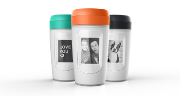
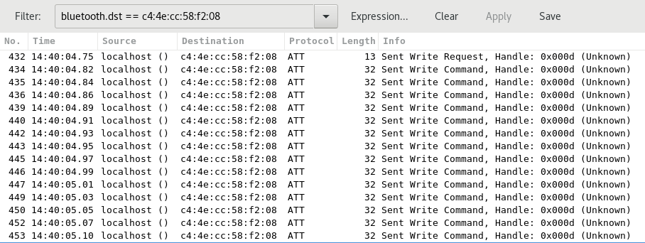
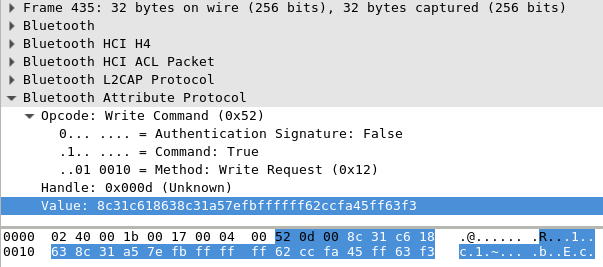
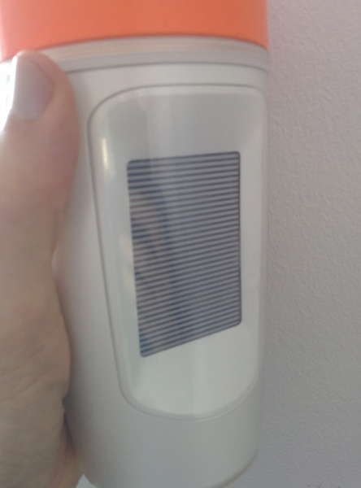
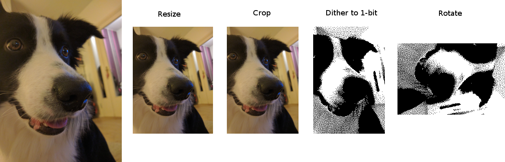
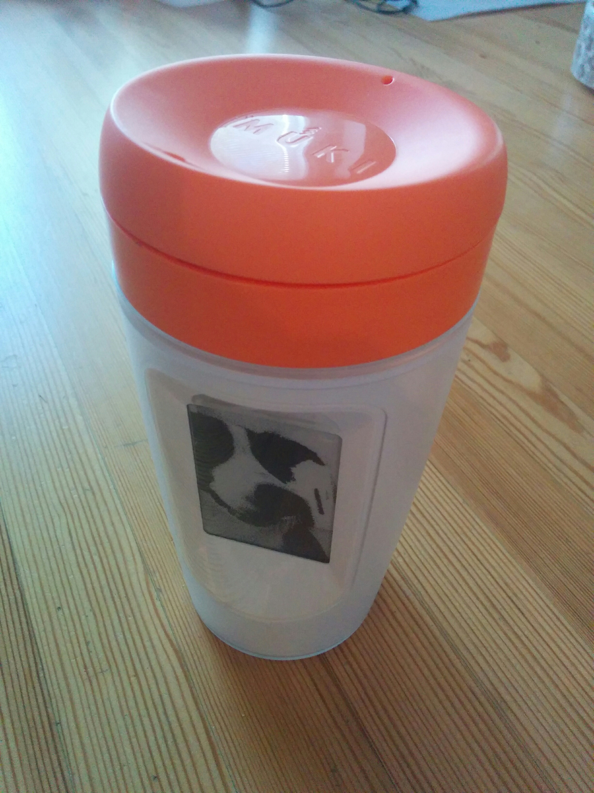

I got my hands on an IOT-enabled coffee mug, [Muki](http://www.pauligshop.com/en_eu/paulig-muki) from Paulig. There's an e-ink display on the side and you can use your phone to upload images to the mug. there's no battery or power plug: Instead a thermoelectric generator transforms heat of the coffee into electricity for the other components!

I did what one does with new IOT devices: had a look under the hood.

## The Good

Sending images to the mug is pretty easy: there is no authentication or encryption. Bluez (the bluetooth stack) and ImageMagick (the image manipulation toolkit) do all the heavy lifting I needed on linux. 

My python scripts are in the same [repo](https://github.com/jku/mukinator) as this writeup. `./muki filename` will upload a photo to a nearby Muki.

## The Bad

Anyone within Bluetooth LE distance can send any images they want to my coffee mug! I'm not sure I can bring the mug to the office after publishing this.

## Figuring it out

Muki documentation mentions it uses Bluetooth Low-Energy and I knew Android allows Bluetooth sniffing (see [How to enable Bluetooth HCI snoop log](https://developer.android.com/studio/debug/dev-options.html)). So I did that, used the Muki app to upload an image to the mug and then moved the log file to my laptop via Google Drive.

I had a look at the log with Wireshark: It contained about a thousand frames but scrolling through revealed only one remote Bluetooth address. This is the beginning of the log when filtering with just this address as destination:

All of the events are Bluetooth attribute writes to one single handle. First and last write have a payload of a single byte (0x74 and 0x64 respectively). All the other 291 writes are 20 bytes each. Here's an example of a 20 byte payload frame:

At this point I did a bit of math: According to manufacturers Facebook page the screen is 176x264 pixels. At bitdepth 1 that's 46464 bits or 5808 bytes. If you divide 5808 bytes into 20 byte frames you end up with _291_ frames, exactly as many as are sent over Bluetooth. That's unlikely to be a coincidence...

I decided to throw something on the wall and see if it sticks: Googling lead me to gatttool from Bluez project as a quick-and-dirty option on Linux. After a bit of reading it seemed clear that I only needed the Bluetooth address and a "ATT characteristic handle" to write with gatttool. Luckily I already had both from wireshark.

I tried entering some write commands manually with gatttool but that didn't work: I probably type too slowly and the device disconnects to save power. Next I wrote a gatttool-abusing script that uses the start and stop values from the sniffed log and otherwise just writes a lot of 0xF0 values:

	console = pexpect.spawn('gatttool -I -t random -b C4:4E:CC:58:F2:08', timeout=3)
	console.expect('\[LE\]>')
	console.sendline('connect')
	console.expect('\[LE\]>')

	console.sendline('char-write-req 0x000d 74')
	console.expect('\[LE\]>')
	for i in range(0,291):
		console.sendline('char-write-cmd 0x000d F0F0F0F0F0F0F0F0F0F0F0F0F0F0F0F0F0F0F0F0')
		console.expect('\[LE\]>')

	console.sendline('char-write-req 0x000d 64')
	console.expect('\[LE\]>')

After a few failed attempts and bug fixes the screen flashed and updated to a striped image!

So the 291 frames are indeed for image data and the data seems to be simply binary pixel values one after the other: The data I was writing was 11110000 in binary and the stripes indeed seemed four pixels high.

> Note: At around this time I happened to find some kind of [Android and iOS library](https://github.com/gustavpaulig/Paulig-Muki/) for Muki on Github: it's not an actual source release (even though it claims to be GPL!) but the Android files are easily decompilable. I took a long enough look at the decompiled sources to verify my findings so far but decided not to use the code for anything -- the uploader claims to be Paulig (the manufacturer) but the whole thing seems a little fishy...

## Producing dithered 1-bit images from photos

So I knew how to send 1-bit images to the mug. Turning a typical photo into decent looking low resolution 1-bit image turned out to be tricky: it's really important to get the dithering (using the density of black dots to approximate the color density) right with such images, otherwise you end up with unrecognisable blobs.

Luckily the [ImageMagick python bindings](http://docs.wand-py.org/en/0.4.4/) cover _just_ enough of functionality to do this in just a few method calls:

    # Resize so that image completely just fills whole
    # viewport, still preserving aspect ratio
    img.transform(resize='176x264^')

    # Crop if the image aspect ratio is incorrect
    img.crop(width=176, height=264, gravity='center')

    # Turn image to black and white, with dithering 
    img.type = 'bilevel'

    # Rotate 90 degrees clockwise
    img.rotate(90)

Next I needed to turn the image data into an array of bytes so I could easily push 20 bytes at a time to the mug. I couldn't figure out how to make Imagemagick do that for me so I did it by hand. The method is ugly and slow but does the job:

    pixels = bytearray(math.ceil(img.width * img.height / 8))

    bit_index = 0
    byte_index = 0
    for row in img:
        for pixel in row:
            # modify the bit
            is_black = pixel.red_int8 == 0 and pixel.green_int8 == 0 and pixel.blue_int8 == 0
            pixels[byte_index] = pixels[byte_index] | (is_black << bit_index)

            bit_index = bit_index + 1
            if bit_index == 8:
                byte_index = byte_index + 1
                bit_index = 0

## Writing images to the device with Bluez API

I did not want to continue abusing gatttool so read up on Bluez D-Bus API. There was now a little more to do: before writing I had to find the device, connect to it and then wait for the correct GattCharacteristic interface to appear. The device is still identified by the _Bluetooth address_ but now I needed a _service UUID_ to identify the characteristic. gatttool was helpful again:

    # gatttool --characteristics -t random -b C4:4E:CC:58:F2:08 | grep 0x000d
    handle = 0x000c, char properties = 0x04, char value handle = 0x000d, uuid = 06640002-9087-04a8-658f-ce44cb96b4a1

So the characteristic service UUID is 06640002-9087-04a8-658f-ce44cb96b4a1.

Finding the service is not too difficult for someone with D-Bus experience but it does take quite a bit of code -- I'm showing only some interesting bits. First I find a Bluetooth device with an address that starts with 'c4:4e:cc':

    objects = self.bluez_manager.GetManagedObjects()

    for path, interfaces in objects.items():
        if 'org.bluez.Device1' not in interfaces.keys():
            continue
        address = interfaces['org.bluez.Device1']['Address']
        if address.lower().startswith('c4:4e:cc'):
            self.device = dbus.Interface(self.bus.get_object('org.bluez', path),
                                         'org.bluez.Device1')

The `ObjectManager.InterfacesAdded` signal will tell me when the device exposes a new service (this happens a short while after connecting): 

    self.bluez_manager.connect_to_signal('InterfacesAdded',
                                         self._object_manager_interfaces_added)
    self.device.Connect(timeout=3)

In the InterfacesAdded signal handler I just make sure it's the right kind of service and has the correct UUID before writing:

    if 'org.bluez.GattCharacteristic1' not in interfaces.keys():
        return

    char_object = self.bus.get_object('org.bluez', path)
    props = char_object.GetAll('org.bluez.GattCharacteristic1',
                                dbus_interface='org.freedesktop.DBus.Properties')
    uuid = props['UUID']
    if uuid.lower() != '06640002-9087-04a8-658f-ce44cb96b4a1':
        return

    self._write_to_muki(dbus.Interface(char_object, 'org.bluez.GattCharacteristic1'))

Finally I use `GattCharacteristic1.WriteValue()` to write the start command (0x74), the image data, and the end command (0x64):

    characteristic.WriteValue(_dbus_array([0x74]),
                              _dbus_dict({}))

    # Write image in 291 chunks, 20 bytes at time
    index = 0
    for i in range(0,291):
        data = self.image[index:index + 20]
        # last one may be too short
        while len(data) < 20:
            data.append(0xFF)

        characteristic.WriteValue(_dbus_array(data),
                                  _dbus_dict({}))
        index = index + 20

    characteristic.WriteValue(_dbus_array([0x64]),
                              _dbus_dict({}))

Voilà:

